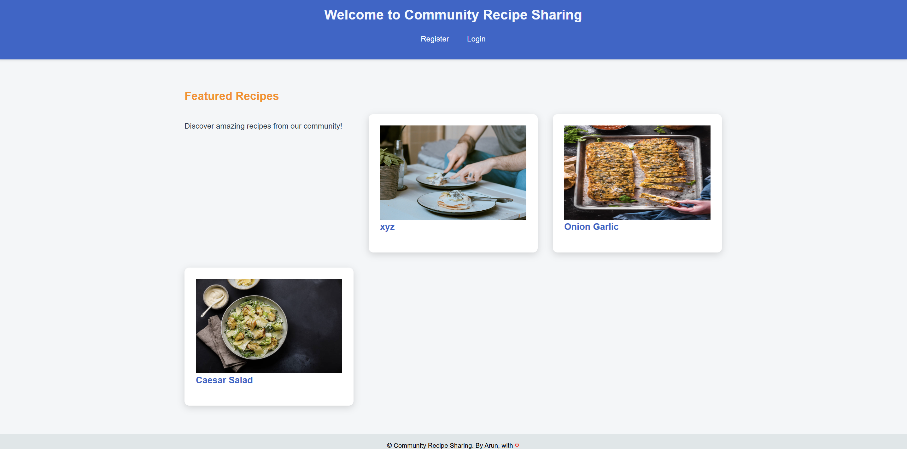
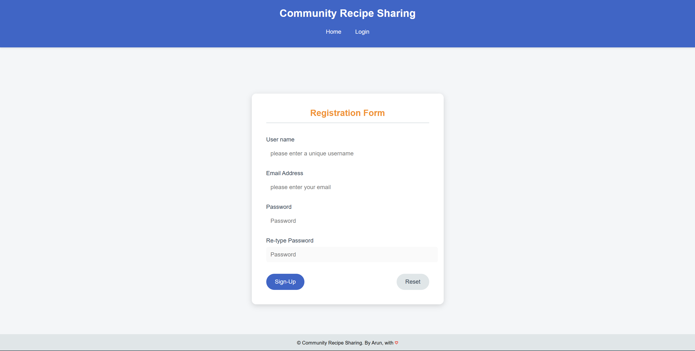
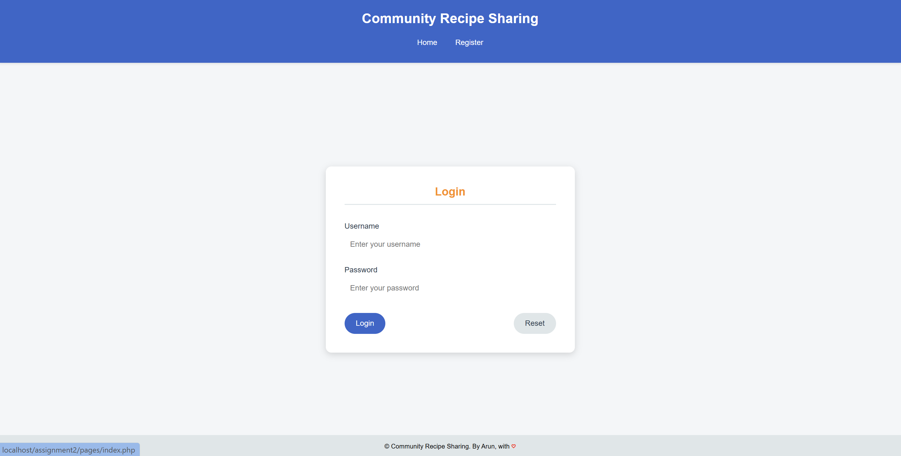
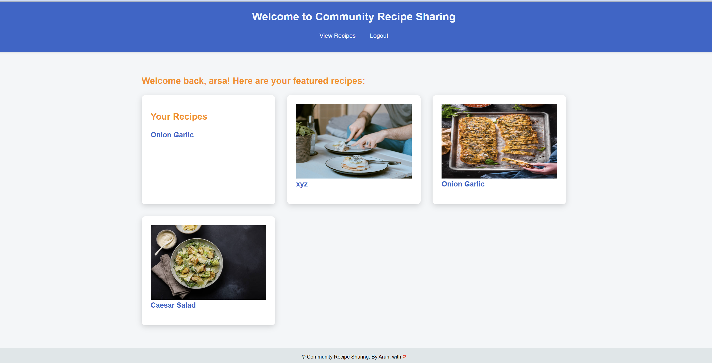
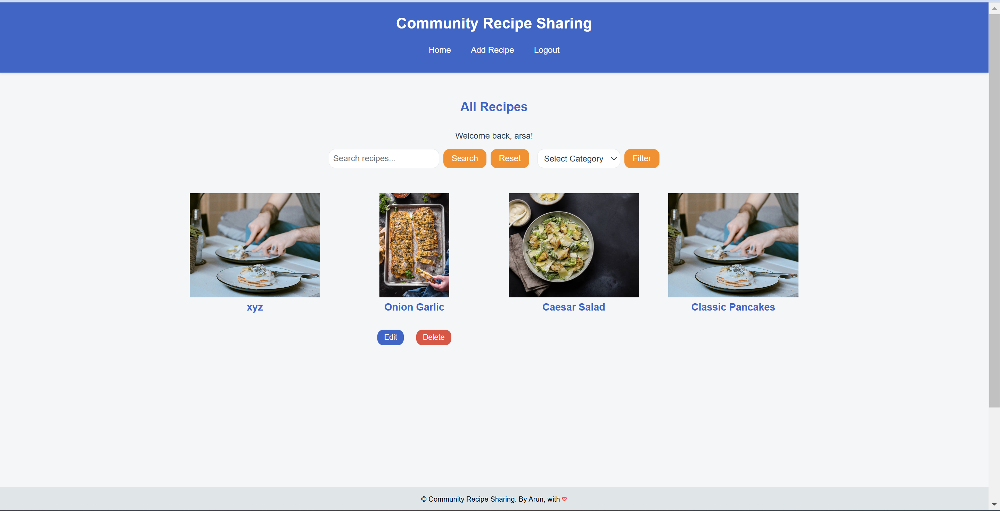
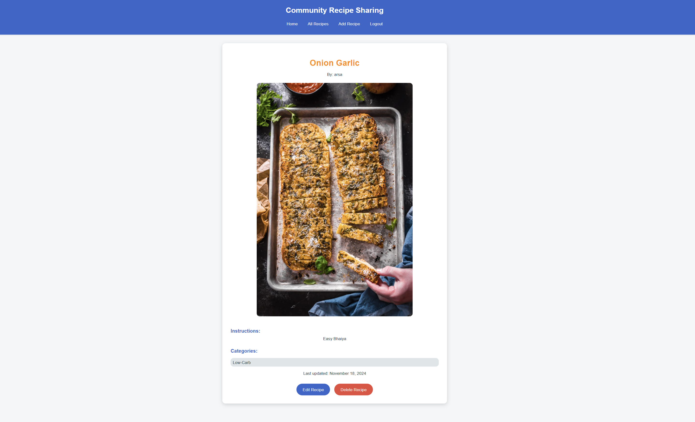
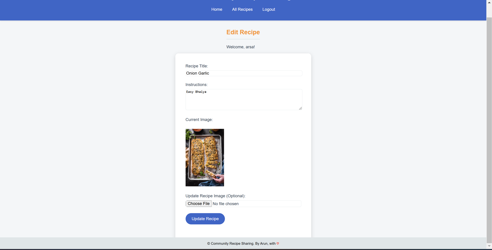

# Community Recipe Sharing

The **Community Recipe Sharing** platform is a web application that allows users to share, manage, and discover recipes. Users can upload their own recipes, explore others' creations, and interact with a user-friendly interface tailored to their account activities.

---

## Features

### Landing Page
- Provides an introduction to the platform and easy access to the registration and login pages.

  

### User Management
- **Register Page**: Allows new users to create an account. User information is stored in the MySQL database. After registering, users are redirected to the  **Login Page**.

  

- **Login Page**: Authenticates users and redirects them to a customized homepage based on their activity.

  

### Homepage
- **First-time Users**: Different Message.
- **Returning Users**: Displays uploaded recipes (if any) with options to manage them.

  

### Recipe Management
- **View Recipes**: Lists all available recipes with search and filtering capabilities. Users can view detailed recipes uploaded by others.

  

  

- **Edit and Delete**: Users can edit or delete only their uploaded recipes. This is enforced through session management.

  

---

## Requirements

1. **Software**:
   - [XAMPP](https://www.apachefriends.org/index.html) (for Apache server and MySQL database).
   - A web browser to access the site.

2. **Languages and Frameworks**:
   - PHP (Server-side scripting).
   - HTML, CSS, JavaScript (Frontend).
   - MySQL (Database).
## Live Demo
[Community recip Sharing](https://arunsagarsa.freesite.online/assignment2/pages/)

